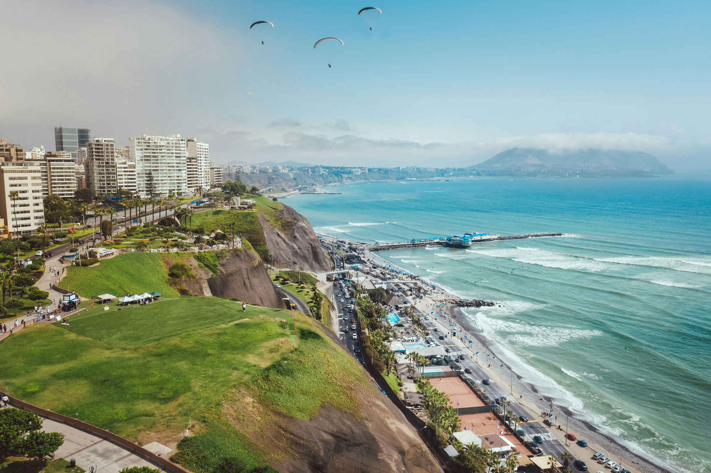

## Intro

Peru is one of those places that gets under your skin in the best way possible. The landscapes are majestic, yes — but it’s the people, the food, the music, and the spiritual hum in the air that made my trip unforgettable. Watching the sun rise over Machu Picchu was a moment I’ll never forget, but so was sipping coca tea in a local market and laughing with a weaver in a quiet Andean village.

This itinerary is designed to guide you through Peru in a way that lets you absorb its layers. From Lima's flavorful food scene to the Sacred Valley’s quiet, powerful energy, every stop offers something memorable. It’s a trip for curious souls who want culture, history, and awe-inspiring beauty all in one.

Wander through Andean pulses, Incan echoes, and sunrise revelations.

## Day 1–2: Lima’s Coastal Flavor

Arrive in Peru’s coastal capital and immerse yourself in its rich culinary culture. Stay in the seaside district of Miraflores, where you can stroll the clifftop parks or watch surfers dotting the Pacific. Grab your first Pisco Sour and enjoy ocean-to-table ceviche as the sun sets.

Explore Lima’s historical center with its ornate balconies and Baroque architecture, then dive into its buzzing street food scene. From anticuchos grilled over open flames to sweet churros, Lima serves up flavor on every corner.

## Day 3: Fly to Cusco, Transition to Altitude

Catch a morning flight to Cusco and begin the transition to the high Andes. Upon arrival, transfer straight to the Sacred Valley to ease into the altitude. The landscape shifts dramatically as you wind through terraced hills and vibrant villages.

Spend your afternoon sipping coca tea and adjusting slowly. The quieter pace of life here encourages you to soak it all in—the mountain air, the quiet hum of local markets, and the deep cultural roots that thread through every cobblestone street.

## Day 4: Ruins & Village Life

Embark on a guided tour of the Sacred Valley’s historic sites. Start at the Pisac ruins, perched high above the valley floor, then wander its colorful market full of handwoven goods and Andean crafts.

Continue to Ollantaytambo, a living Incan town where stone terraces climb the hillsides and children play in alleys that haven’t changed in centuries. Enjoy lunch with a local family or in a garden cafe overlooking the ruins.

## Day 5: Sunrise at Machu Picchu

Take the scenic Vistadome train through cloud forests and river valleys to Aguas Calientes, gateway to Machu Picchu. After a short shuttle up the mountain, step into one of the world's most iconic sites.

Climbing through the citadel just as the morning mist lifts is an experience you won’t forget. Your guide will share the site’s ancient secrets, but it's the silence and sense of awe that will stay with you the longest.

## Day 6: Sacred Valley Immersion or Rest

After the intensity of Machu Picchu, enjoy a slower pace. Visit a traditional weaving cooperative, go horseback riding, or take a yoga class facing the Andes. You could also simply relax and journal your experiences from a hammock under the sun.

This is your day to absorb. The Sacred Valley is about more than sights—it's about a feeling, a rhythm, a pause from modern noise.

## Day 7: Cusco’s Colonial Charms

Return to Cusco and explore its rich blend of Incan foundations and Spanish colonial flair. The Plaza de Armas is a perfect spot to people-watch with a coffee, or wander into the San Pedro Market for spices, produce, and keepsakes.

In the evening, dine with a view, take in a folklore show, or simply enjoy the golden-hour glow on ancient walls.

## Day 8: Farewell to Peru

Take in one last panoramic view of Cusco before your airport transfer. Whether you're heading home or onto your next destination, the flavors, faces, and sacred spirit of Peru will remain.

* * *

**This trip can be adapted with hiking, luxury trains, or cultural deep dives.**  
[📬 Let’s Design It Together](#)